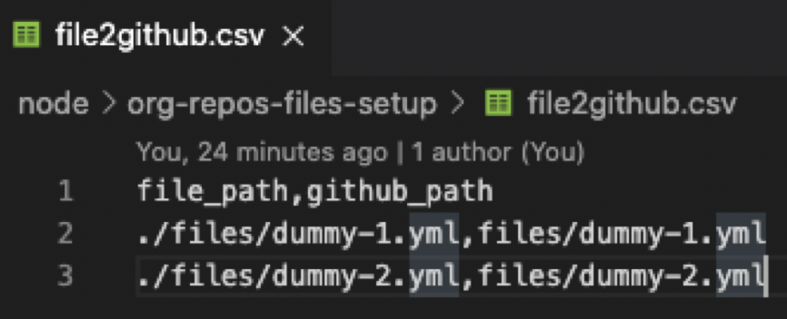

# @github - Add Files to many Repositories on your Org

## ℹ Description

- Setup GitHub multiple files on a large set of Repositories under your Organization, and want to prevent manual errors and need to be careful while adding the files at the right location in your GitHub Repositories.
- Delete files across a large set of repositories.
- Honor or Bypass the Branch Protection logic.

## Setup

1. Copy the `repo_list.csv_example` to `repo_list.csv` and fill the repository data.
2. Copy the `file2github.csv_example` to `file2github.csv` and fill the file details to be added.

3. Copy the `.env.example` to `.env` and fill in the vaules for:
- `GITHUB_TOKEN`: A GitHub Personal Access token with Full Private `repo` scope
- `GITHUB_ORGANIZATION`: The name of the organization you want to read the data for.
- `REPO_LIST_FILE`: CSV formatted List of Repositories. Example: [repo_list.csv](./repo_list.csv_example) 
- `FILE_LIST_CSV`: CSV formatted List of Local Files and their target GitHub locations. Example: [file2github.csv](./file2github.csv_example) 
- `GITHUB_BRANCH`: ["master", "integration"]. Array list of branch names you want to push the files to.  
- `GITHUB_BRANCH_PROTECTION_OVERRIDE`: true or false. Do you want to add the files even if there is a branch protection or not. 
- `GIT_NAME`= Name of the Author who wants to make the commit. 
- `GIT_EMAIL`= Email of the Author who wants to make the commit. 
- `DEL_FILES`=true. Delete all the files from the Repositories.

### Run it locally

Install [Node.js](https://nodejs.org/en/download/) v12.16.3 or above. 

Run the below commands from within this folder.

```sh
npm install
node index.js
```

### Example Run:

```sh
node index.js
```

#### `.env`


#### `file2github.csv`


#### `repo_list.csv`


#### run_example 


### Troubleshooting 
In `.env`:
- Pass `DEBUG_MODE`=true. All the debug logs will be printed on the screen. 


### [octokit.github.io](https://octokit.github.io/rest.js/v18) API Calls in the Code

- octokit.repos.get
- octokit.git.createRef
- octokit.repos.getBranchProtection
- octokit.repos.deleteBranchProtection
- octokit.repos.getContent
- octokit.repos.updateBranchProtection
- octokit.repos.createOrUpdateFileContents
- octokit.repos.listBranches
- octokit.repos.deleteFile

## 👨🏻‍💻 Maintainers
This repository is maintained by:

| | |
|:---:|:---:|
| [](https://github.com/dhruvg20) | [@dhruvg20](https://github.com/pattacini) |

Please share your feedbacks and inputs.